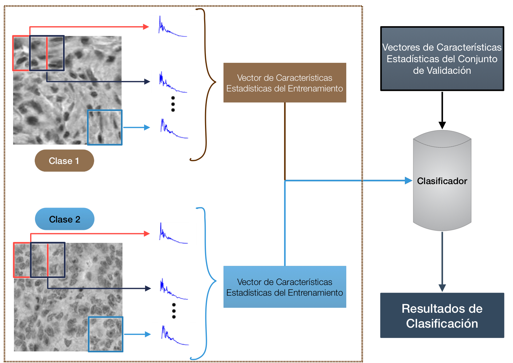
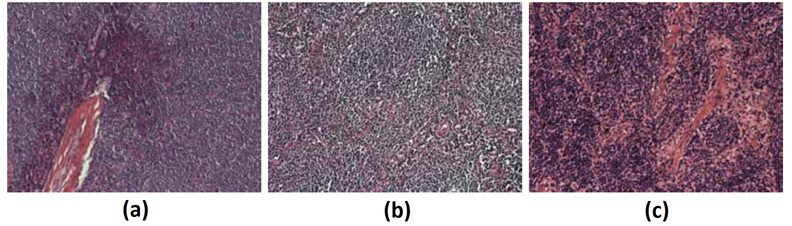
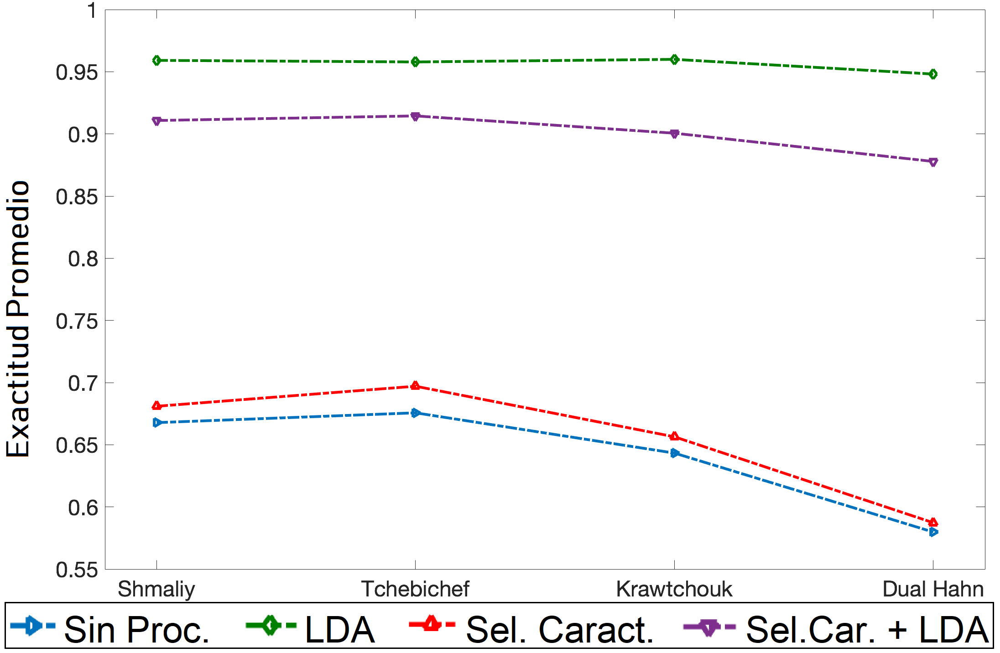
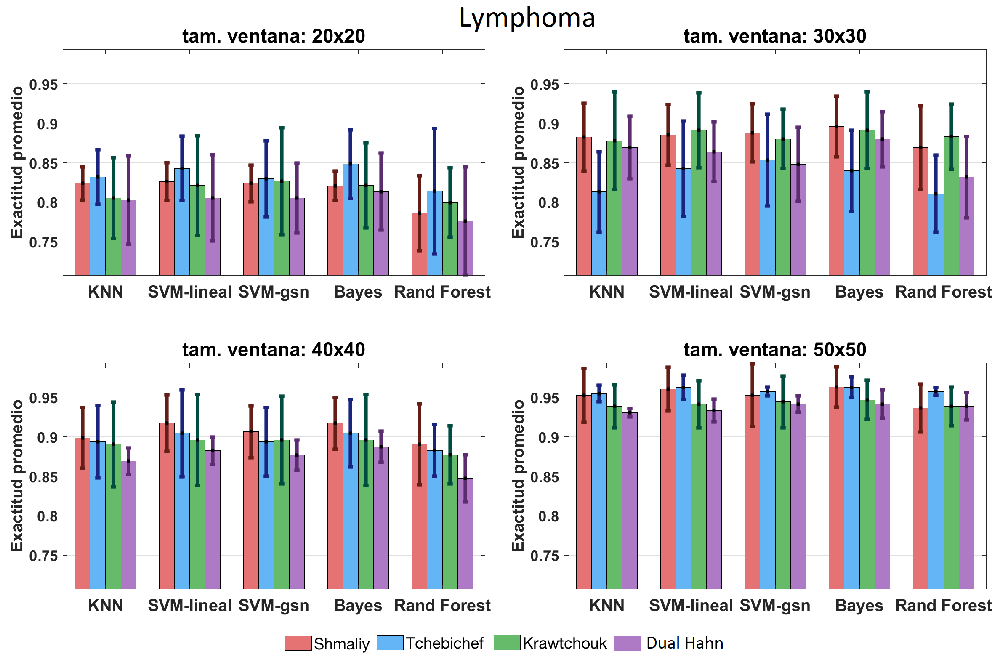

# Aplicaciones de los Momentos Ortogonales
En esta carpeta se incluye un ejemplo de cómo utilizar diferentes familias de momentos ortogonales discretos como descriptores de textura en imágenes. Con dichos descriptores se generarán vectores de características que funcionarán para realizar la clasificación de imágenes dentro de una base de datos. Este trabajo fue publicado con el título [*A Comparative Study on Discrete Shmaliy Moments and Their Texture-Based Applications*](https://www.hindawi.com/journals/mpe/2018/1673283/) y en la Tesis Doctoral [*Descripción y clasificación de texturas basada en polinomios ortogonales discretos.*](http://132.248.9.195/ptd2018/septiembre/0780559/Index.html)

## Momentos ortogonales discretos
Los momentos discretos son cantidades escalares que se usan para caracterizar una función (imagen) a través del cálculo de atributos significativos de ella. Matemáticamente, el momento Mpq de una Imagen ***I(x,y)*** es la proyección de la imagen sobre una base polinomial bidimensional ***r_pq*** y se define como:

entonces, el momento es la medida de correlación entre la imagen y la base polinomial.

## Polinomios ortogonales discretos 
Las bases polinomiales discretas utilizadas en este ejemplo son: Tchebichef, Krawtchouk, Dual-Hahn y Shmaliy. Las primeras tres bases son solución a la ecuación en diferencias:

### Polinomios de Tchebichef
Los polinomios discretos de [Tchebichef](https://ieeexplore.ieee.org/document/1315694) de orden ***n*** se definen como:

donde ***x,n = { 0,1,2, ..., N-1}***. La función hipergeométrica se establece como:

 

donde el símbolo de Pochhammer es:

### Polinomios de Krawtchouk
 La definición de los polinomios clásicos de [Krawtchouk](https://ieeexplore.ieee.org/document/1240103) de orden ***n*** es:
 

0&space;\right\rbrace&space;$&space;,&space;$p&space;\>&space;\in&space;\>&space;(0,1)." title="\text{donde } x,n = \left\lbrace 0,1,2, \ldots, N, N>0 \right\rbrace $ , $p \> \in \> (0,1)." />

La función hipergeométrica se define como:

### Polinomios Dual Hahn

Los polinomios [dual Hahn](https://www.sciencedirect.com/science/article/pii/S0167865507001341) de orden ***n*** se definen de la siguiente manera:

 
 La función general hipergeométrica dada por:

### Polinomios de Shmaliy

Shmaliy desarrolló los polinomios discretos de respuesta finita al impulso no sesgado (UFIRs) de un parámetro para filtros FIR basados en FIRs predictivos de un paso. Después, Morales-Mendoza muestran que los UFIRs conforman una nueva familia de polinomios ortogonales discretos que también dependen de la longitud ***N*** de los datos, como único parámetro para su expansión. 
Los polinomios [Shmaliy](https://www.sciencedirect.com/science/article/pii/S016516841300039X) de grado ***p*** se definen como:

y los coeficientes son:

 

Los elementos de la matriz de Hankel son series de potencias:

donde ***Bk(x)*** es el polinomio de Bernoulli y ***Bk(0)*** es el número de Bernoulli. Sustituyendo, obtenemos un polinomio de variable discreta n es:

## Descripción de textura con momentos ortogonales discretos

La base polinomial actúa como el filtro en la descripción basada con Momentos Ortogonales Discretos. EL valor del momento es mayor si las variaciones son similares a los valores de la base polinomial en las direcciones X y Y. Esta característica es importante para el análisis de textura porque la textura es definida como la repetición espacial de patrones en escala de gris en una región dentro de la imagen. Por lo tanto, es posible obtener una descripción de la textura cuando el momento de orden ***s*** es evaluado. La descripción está relacionada con las respuestas en frecuencia de la base polinomial. Entonces, el vector de características o **firma de textura** ***M(s)*** basada en momentos ortogonales discretos se calcula de la siguiente manera:

El cálculo de los polinomios ortogonales discretos es susceptible a la inestabilidad numérica conforme el orden aumenta. Es por ello, que se propone utilizar una descripción basada en ventanas cuadradas traslapadas que recorren la imagen, y así evitar el cálculo de polinomios y momentos de orden alto para mantener la estabilidad numérica de la descripción. Resulta evidente que el uso de las ventanas traslapadas genera una sobredescricpión de la imagen, por eso se calculan **firmas estadísticas de textura** basadas en el promedio, la desviación estándar y la curtosis de los vectores obtenidos de todas las ventanas de cada imagen.

La **firma estadística de textura** ***t***, basada en la descripción de textura ***M(s)***, es calculada para cada ventana donde ***i*** es la posición de la ventana, que se desplaza de izquierda a derecha y de arriba hacia abajo. La firma ***t*** se contruye de la siguiente manera:

El esquema general  de clasificación indica que se calcula una firma estadística de textura para cada imagen del conjunto de entrenamiento. Las firmas entran al clasificador que se encargará de generar una regla con la que posteriormente las características calculadas para el conjunto de validación serán clasificadas. En la siguiente figura se muestra el esquema general de la clasificación con firmas de textura estadísticas. 

 

# Aplicación: Clasificación de Lymphoma

## Bases de datos

La base de datos de prueba se llama ***Lymphoma*** y pertenece al benchmark [IICBU-2008](https://ome.grc.nia.nih.gov/iicbu2008/). Esta base de datos está compuesta por tres tipos de enfermedades hematológicas:

 - **Leucemia linfocítica crónica (CLL)** con 133 muestras. 
 - **Linfoma folicular (FL)** con 139 muestras.
 - **Linfoma de células del manto (MCL)** con 122 muestras.

La siguiente figura contiene muestras de cada clase de la base de datos. Cabe resaltar que las imágenes originales fueron escaladas a la mitad y transformadas a escala de grises.

## Descripción de los programas

### Cálculo de los vectores de características de textura
El programa llamado **MomSTKDLymphoma.m** se encarga de generar los vectores de características de textura de cada ventana y, para cada base polinomial, los almacena en los siguientes archivos:
 - **Lymphoma_TchebiMomentos.mat**
 - **Lymphoma_KrawtMomentos.mat**
 - **Lymphoma_DHahnMomentos.mat**
 - **Lymphoma_ShmaliyMomentos.mat**
 
### Cálculo de los vectores estadísticos de textura
Después de calcular los vectores de textura de cada ventana, en el programa **Caracteristicas_STKD_Lymphoma.m** se agruparán en 7 diferentes grupos o combinaciones basados en el promedio, desviación estándar y curtosis, es decir, se concatenarán dichos vectores para formar distintos vectores estadísticos de textura:

 1. **Promedio, desviación estándar y curtosis.**
 2. **Promedio y desviación estándar.**
 3. **Promedio y curtosis.**
 4. **Desviación estándar y curtosis.**
 5. **Promedio.**
 6. **Desviación estándar.**
 7. **Curtosis.**
 
Estos vectores estadísticos de características se calculan para cada base polinomial y se almacenan en los archivos:

 - **Lymphoma_CaracteristicasS.mat**: basados en los polinomios de Shmaliy.
 - **Lymphoma_CaracteristicasT.mat**: basados en los polinomios de Tchebichef.
 - **Lymphoma_CaracteristicasK.mat**: basados en los polinomios de Krawtchouk.
 - **Lymphoma_CaracteristicasD.mat**: basados en los polinomios dual Hahn.
 
 ### Clasificación de la base de datos
 
 Una vez que tenemos los vectores estadísticos, ahora hay que entrenar a un clasificador para su posterior evaluación. La validación será a través del esquema **validación cruzada de 5 grupos** y la métrica selecciona para validar el rendimiento del esquema de clasificación es el *Accuracy* (Exactitud), que se obtiene a partir del promedio de la validación de cada grupo. En resumen, estos son los parámetros variables utilizados para este experimento:
 
 - **Familias de Momentos Discretos:** Los vectores característicos de textura  se calculan a partir de las bases polinomiales discretas de Shmaliy, Tchebichef, Krawtchouk y dual Hahn.

 - **Tamaño de ventana de análisis:** los tamaños de las ventanas de análisis para calcular las firmas estadísticas de textura son 20x20, 30x30, 40x40 y 50x50 pixeles. Este tamaño está limitado porque el cálculo de los polinomios dual Hahn es inestable a partir de de ventana de 50x50. Esa inestabilidad se debe a la acumulación del error en las recursiones, tal y como se mencionó anteriormente. Por lo tanto, el tamaño de la ventana se limita para todas las familias de polinomios con el fin de comparar los resultados de las cuatro bases polinomiales bajo las mismas condiciones.

 - **Procesamiento de las firmas de textura:** Antes de que las firmas de textura estadística entren a los clasificadores se les aplica el siguiente tratamiento: Análisis Discriminante Lineal (*LDA*), selección recursiva de características y la combinación de ambas (selección recursiva y *LDA*, en ese orden). Evidentemente, las pruebas también se realizaron sobre las firmas estadísticas sin tratamiento alguno.

 - **Clasificadores:** Los algoritmos de clasificación utilizados son: $K$ vecinos más cercanos (*kNN*), máquina de soporte vectorial con kernel lineal (*SVM* lineal) y con kernel Gaussiano (*SVM* gauss), *Random Forest* y *naive* Bayes.

**Ahora, cabe mencionar que toda la parte de descripción de textura basada en momentos ortogonales discretos está desarrollada en MATLAB. Mientras que, la parte de procesamiento de las firmas de textura y la clasificación a través de los métodos antes mencionados fue escrita en Python utilizando librerías como: Numpy, Scipy y Sci-kit learn.**

El procesamiento de las firmas y clasificación se puede encontrar en los siguientes programas:
 - **ClasificacionFinal_Lymphoma_ver2.py:** clasifica las firmas de cada base polinomial sin ningún tipo de procesamiento.
 - **ClasificacionLDAFinal_Lymphoma_ver2.py:** clasifica las firmas de cada base polinomial con *LDA*.
 - **ClasificacionLDAFinal_Lymphoma_ver2.py:** clasifica las firmas de cada base polinomial selección de características.
 - **ClasificacionLDASelCarRFFinal_Lymphoma_ver2.py:** clasifica las firmas de cada base polinomial con selección de características y *LDA*.

 Los resultados son almacenados en formato ***.mat*** para visualizarlos en MATLAB y los podemos encontrar en los archivos:
  - Para Shmaliy: **ResultadosS_Lymphoma, ResultadosS_LDA_Lymphoma, ResultadosS_SelCarRF_Lymphoma** y **ResultadosS_LDA_SelCarRF_Lymphoma**.
  - Para Tchebichef: **ResultadosT_Lymphoma, ResultadosT_LDA_Lymphoma, ResultadosT_SelCarRF_Lymphoma** y **ResultadosT_LDA_SelCarRF_Lymphoma**.
  - Para Krawtchouk: **ResultadosK_Lymphoma, ResultadosK_LDA_Lymphoma, ResultadosK_SelCarRF_Lymphoma** y **ResultadosK_LDA_SelCarRF_Lymphoma**.
  - Para dual Hahn: **ResultadosD_Lymphoma, ResultadosD_LDA_Lymphoma, ResultadosD_SelCarRF_Lymphoma** y **ResultadosD_LDA_SelCarRF_Lymphoma**.
  
Puesto que son muchos resultados para mostrar, se límita a trabajar sólo con los vectores promedio, es decir, la opción 5 de vectores estadísticos. Además, se elige el mejor procesamiento de los vectores estadísticos con base en la siguiente gráfica:

Se observa que el **Análisis Discriminante Lineal** es el mejor tipo de procesamiento. En la siguiente figura se observa que los mejores resultados se obtienen con ventanas mayores que 40x40.

  
